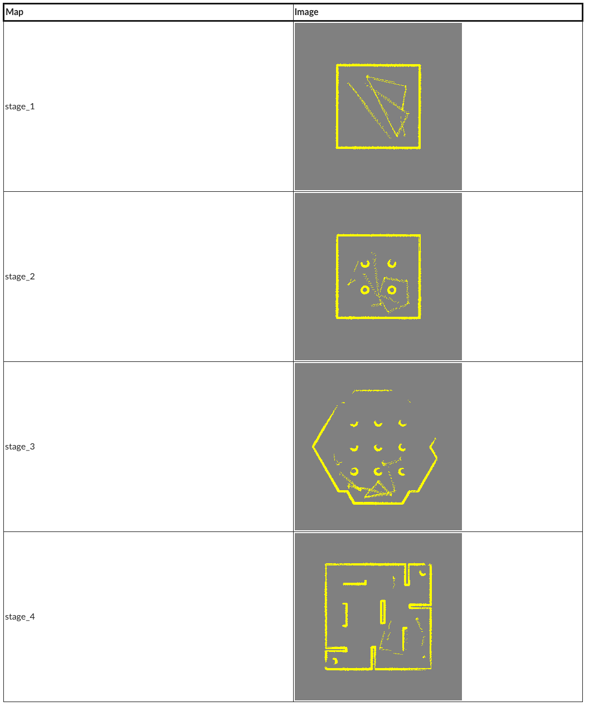
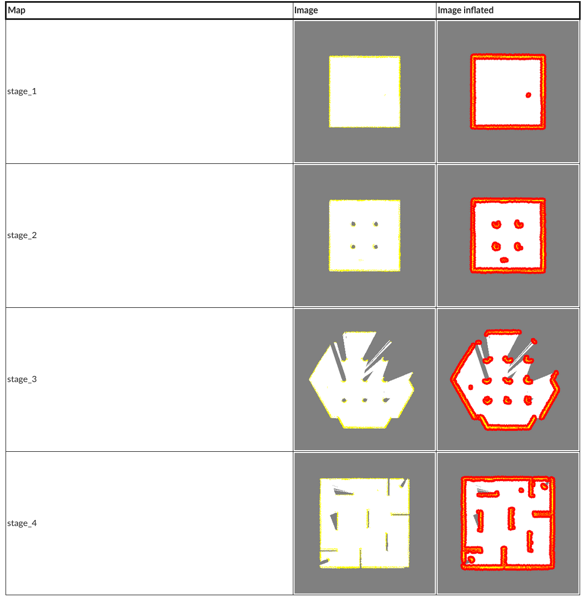
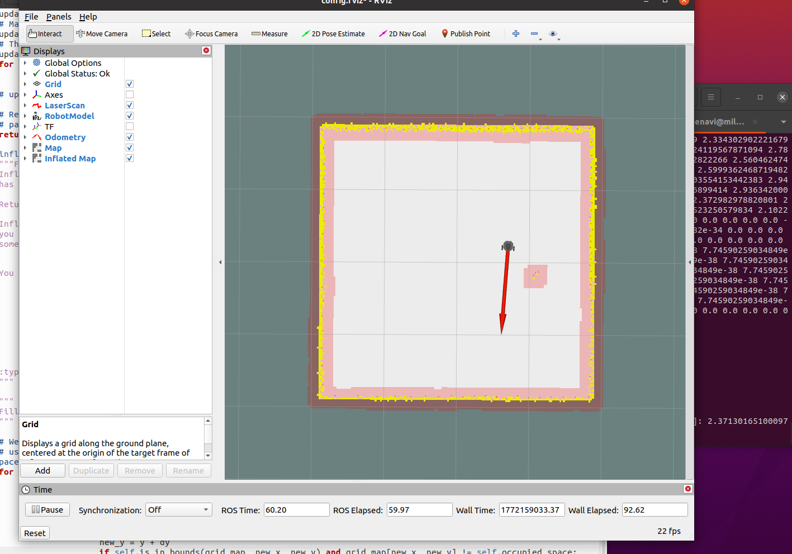

# Mapping -- DD2410 HT23 Introduction to Robotics (Irob23)

This repository contains the implementation of the **Mapping
Assignment** for the course\
**DD2410 -- Introduction to Robotics** at KTH.

The assignment focuses on **2D Occupancy Grid Mapping** using ROS.

---

# Overview

Mapping is a core capability of autonomous robots. In this assignment,
the robot builds a map of an unknown environment using:

- Robot pose
- Laser scan measurements
- Occupancy grid representation

We implement mapping using ROS messages and process recorded rosbag
data.

---

# Occupancy Grid Mapping

The environment is represented as a 2D grid:

- Each cell represents a fixed area in the world
- Cells can be:
  - Unknown
  - Occupied
  - Free
  - C-space (inflated obstacles, C assignment)

Resolution determines how much area each grid cell covers.

---

# ROS Messages Used

You will work with the following ROS messages:

### geometry_msgs/PoseStamped

Used to get the robot position and orientation (quaternion).

### sensor_msgs/LaserScan

Used to obtain: - angle_min - angle_max - angle_increment - range_min -
range_max - ranges\[\]

Invalid measurements: (values \<= range_min or \>= range_max should be
discarded)

### nav_msgs/OccupancyGrid

Stores the map in row-major order.

### map_msgs/OccupancyGridUpdate

Used in C assignment to only publish updated map region.

---

# Installation

1.  Download the ROS package into your ROS workspace
2.  Run:

```bash
catkin_make
source devel/setup.bash
```

---

# Running the Assignment

## Recommended: Using ROS + rosbag

Open four terminals:

Terminal 1:

```bash
roscore
```

Terminal 2:

```bash
roslaunch mapping_assignment play.launch
```

Terminal 3:

```bash
rosbag play --clock BAGFILE
```

Terminal 4:

```bash
rosrun mapping_assignment main.py
```

NOTE: Restart main.py when restarting rosbag.

---

# Alternative: Using Text Files

```bash
rosrun mapping_assignment main.py FILE
```

Maps will be saved to:

    mapping_assignment_metapackage/mapping_assignment/maps/FILE/

---

# Part 1 -- E Assignment

Modify:

    mapping_assignment_metapackage/
    └── mapping_assignment/
        └── scripts/
            └── mapping.py

Implement:

    update_map(self, grid_map, pose, scan)

### Steps

1.  Convert laser scan ranges + bearings → laser frame coordinates
2.  Transform to map frame
3.  Convert to map indices (use int(X), NOT round(X))
4.  Mark occupied cells

Do NOT fill in:

    update = OccupancyGridUpdate()

### Goal

Match the provided correct maps for:

- stage_1
- stage_2
- stage_3
- stage_4

Below in the table you will find an image for each of the four maps. This is how your corresponding map should look if you have done the assignment correctly. You can find images of all correct maps in the folder mapping_assignment_metapackage/mapping_assignment/correct_maps/.



The yellow part of the images is occupied space, while the gray part is unknown space.

Yellow = Occupied\
Gray = Unknown

Passing this part gives an **E grade**.

---

# Part 2 -- C Assignment

Now additionally:

1.  Clear free space using:

```{=html}
<!-- -->
```

    raytrace(self, start, end)

Use `self.free_space`.

2.  Mark occupied space

3.  Fill in:

```{=html}
<!-- -->
```

    update = OccupancyGridUpdate()

Only publish updated rectangle area.

4.  Inflate obstacles in:

```{=html}
<!-- -->
```

    inflate_map(self, grid_map)

Use `self.c_space`.

Below is the table for the inflated obstacles (C-space) maps.





The yellow part of the images is occupied space, the white free space, gray unknown space, and red C-space.

### Map Colors

- Yellow → Occupied
- White → Free
- Gray → Unknown
- Red → C-space (inflated obstacles)

---

# Debugging

Check update message:

```bash
rostopic echo /map_updates
rostopic echo /map_updates --noarr
```

Verify: - x - y - width - height - data length (1D array)

Order of updates matters --- avoid overwriting incorrect values.

---

# Key Concepts

- Coordinate frame transformations
- Ray tracing
- Occupancy grid updates
- Configuration space (C-space)
- Efficient map publishing

---

# Requirements

- ROS (Noetic recommended)
- Python 3
- NumPy

---

# Final Notes

- Clear free space between robot and obstacle
- Be careful with index conversion (int only)
- Only update changed map region for efficiency
- Test using provided rosbags
- Compare output with correct maps before submission

---

**Course:** DD2410 -- Introduction to Robotics\
**Assignment:** Mapping\
**Term:** HT23
